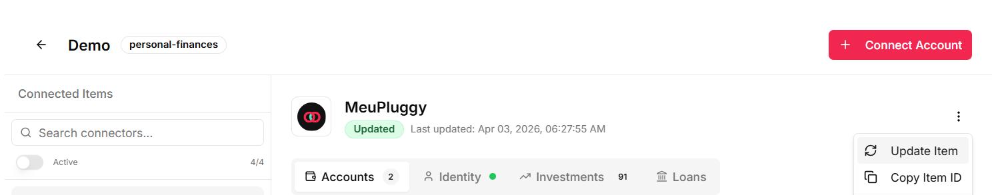

# personal-finance

> **Let your agents do the work.** Connect your bank accounts, run `/compile`, and get a full monthly budget report — no spreadsheets, no manual entry.

AI-powered personal finance toolkit that fetches bank transactions via Open Finance, classifies expenses, recognizes income, and generates monthly budget reports — all orchestrated through Claude Code skills.

Looking for the web dashboard? See [personal-finance-viewer](https://github.com/icesnow10/personal-finance-viewer) — a standalone Next.js app that visualizes the budget JSONs this project generates.

## Skills

This project uses [Claude Code](https://claude.ai/claude-code) skills (`.claude/skills/`) to automate the monthly budget workflow. Each skill can be invoked directly or orchestrated by `/compile`.

| Skill | What it does |
|---|---|
| `/compile` | Orchestrates the full pipeline: runs `/fetch` -> `/recognize` -> `/categorize` -> `/forecast` (if partial month), computes budget buckets, and generates a JSON report. Just run `/compile` for the target month. |
| `/fetch` | Connects to the [Pluggy](https://pluggy.ai) Open Finance API to download BANK + CREDIT CARD transactions. Normalizes everything into `resources/{YYYY-MM}/expenses/transactions_raw.json`. Falls back to manual CSV parsing if Pluggy is unavailable. |
| `/recognize` | Identifies income from savings account movements — salary, cashback, IOF adjustments, investment yields, named transfers. Matches salary by amount + date window rules from `resources/income_inputs.md`. Provisions expected salary for partial months. |
| `/categorize` | Classifies expenses into categories (Groceries, Housing, Health, etc.) using merchant mappings from `resources/expenses_memory.md`. Nets refunds against original categories, tracks auto-investments (Troco Turbo), and flags unmatched items for review. Updates the memory file with new mappings. |
| `/provision` | Partial months only. Estimates recurring fixed costs (rent, utilities, subscriptions, insurance) that haven't appeared yet, based on the last 2 completed months. Each item provisioned individually. Checks active vs cancelled subscriptions. |
| `/forecast` | Partial months only. Combines `/recognize` (salary provisioning) + `/provision` (expense estimates) to project a full-month budget. All provisioned items tagged `provisional: true` and replaced by actuals when re-compiled with complete data. |

## Connecting to Pluggy (Open Finance)

The `/fetch` skill uses [Pluggy](https://pluggy.ai) to pull bank transactions via Brazil's Open Finance ecosystem. Follow these steps to set it up:

### Step 1: Create a MeuPluggy account

1. Go to [meu.pluggy.ai](https://meu.pluggy.ai) and sign up
2. Connect your bank accounts — select your financial institution and authorize via Open Finance
3. Once connected, Pluggy will have access to your checking accounts, savings, credit cards, and transactions

> If you have multiple banks, you'll need to authorize each one separately.

### Step 2: Create a Developer account

1. Go to [dashboard.pluggy.ai](https://dashboard.pluggy.ai) and register (includes a 15-day free trial — personal use is unlimited and free)
2. Create a new application to get your `client_id` and `client_secret`

### Step 3: Link your MeuPluggy account to the Developer app

1. In the Pluggy Dashboard, go to the Demo application
2. Use OAuth authorization to connect your MeuPluggy account
3. This creates an **Item** for each connected bank — note down the Item IDs

> Full walkthrough: [github.com/pluggyai/meu-pluggy](https://github.com/pluggyai/meu-pluggy)

### Step 4: Copy Item IDs

1. No Pluggy Dashboard, dentro da sua aplicação Demo, você verá os **Connected Items** listados (um por banco conectado)
2. Clique no menu **⋮** (três pontos) ao lado do item desejado
3. Selecione **Copy Item ID**



Repita para cada banco conectado. Você vai precisar desses IDs no próximo passo.

### Step 5: Configure credentials

Create a `.env.local` file at the project root:

```env
PLUGGY_CLIENT_ID=your_client_id_here
PLUGGY_CLIENT_SECRET=your_client_secret_here
PLUGGY_ITEM_IDS=item_id_1,item_id_2
```

### Step 6: Run your first fetch

```
/fetch
```

On the first run, the skill will list all accounts for each Item and ask you to map them to household members. This mapping is saved to `resources/pluggy_items.json` for future runs.

## Project Structure

```
resources/
  expenses_memory.md          # Merchant-to-category mappings and budget rules
  income_inputs.md            # Salary definitions and income source rules
  pluggy_items.json           # Pluggy account-to-holder mapping
  {YYYY-MM}/
    expenses/
      transactions_raw.json   # Normalized transactions (from /fetch)
      result/
        budget_{month}_{year}.json  # Final budget report (from /compile)
.claude/
  skills/                     # Claude Code skill definitions
.env.local                    # Pluggy API credentials (not committed)
```

## FAQ

**Posso conectar mais de uma conta bancária?**
Sim. O MeuPluggy permite conectar múltiplas instituições financeiras. Cada banco conectado gera um Item separado na API do Pluggy. Adicione todos os Item IDs separados por vírgula em `PLUGGY_ITEM_IDS` no `.env.local`.

**Posso adicionar contas de pessoas diferentes (household)?**
Sim. Na primeira execução do `/fetch`, o skill pergunta a qual membro da casa cada conta pertence. O mapeamento fica salvo em `resources/pluggy_items.json`.

**E se o Pluggy estiver fora do ar ou eu não tiver conta?**
O `/fetch` aceita CSVs manuais como fallback. Coloque os arquivos em `resources/{YYYY-MM}/expenses/input/` seguindo o padrão de nome: `cc-{holder}-*.csv` para cartão de crédito e `savings-{holder}-*.csv` para conta corrente.

**Precisa rodar `/compile` todo mês?**
Sim. Rode durante o mês para ter uma projeção (partial month com provisioning) e novamente após o fechamento para o relatório final com dados completos.

## Requirements

- [Claude Code](https://claude.ai/claude-code) CLI
- A [Pluggy](https://pluggy.ai) account with connected bank accounts (or manual CSVs)
- Node.js (for API calls)
