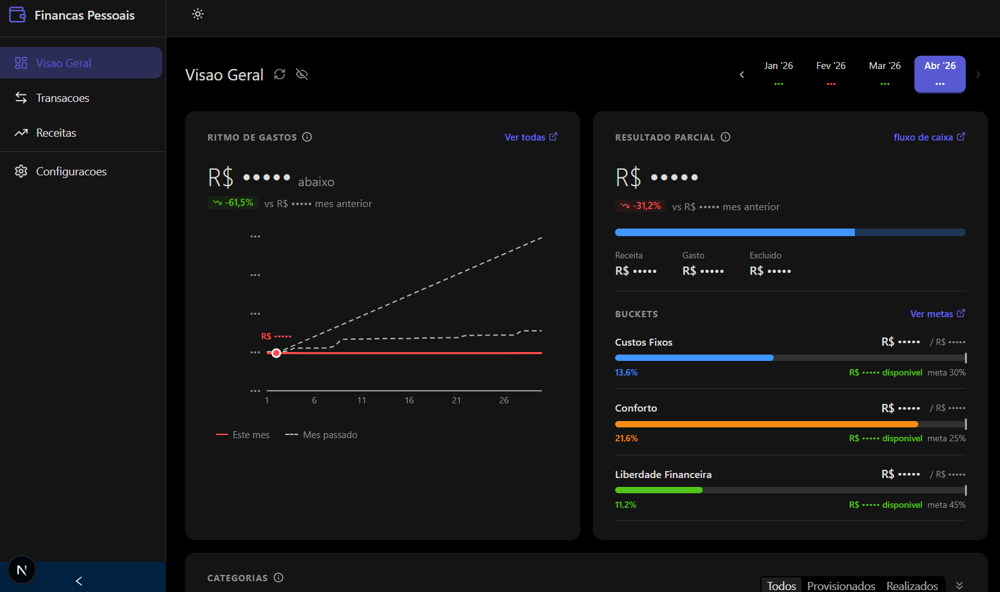

# personal-finance

> **Let your agents do the work.** Connect your bank accounts, run `/compile`, and get a full monthly budget report — no spreadsheets, no manual entry.

AI-powered personal finance toolkit that fetches bank transactions via Open Finance, classifies expenses, recognizes income, and generates monthly budget reports — all orchestrated through Claude Code skills.

Looking for the web dashboard? See [personal-finance-viewer](https://github.com/icesnow10/personal-finance-viewer) — a standalone Next.js app that visualizes the budget JSONs this project generates.

## Skills

| Skill | What it does |
|---|---|
| `/onboard` | **Start here.** Interactive setup wizard that creates the project structure, walks through Pluggy connection, configures household members and salary definitions, and runs your first `/fetch` + `/compile`. |
| `/compile` | Orchestrates the full pipeline: runs `/fetch` -> `/recognize` -> `/categorize` -> `/forecast` (if partial month), computes budget buckets, and generates a JSON report. Just run `/compile` for the target month. |
| `/fetch` | Connects to the [Pluggy](https://pluggy.ai) Open Finance API to download BANK + CREDIT CARD transactions. Normalizes everything into `resources/{YYYY-MM}/expenses/transactions_raw.json`. Falls back to manual CSV parsing if Pluggy is unavailable. |
| `/recognize` | Identifies income from savings account movements — salary, cashback, IOF adjustments, investment yields, named transfers. Matches salary by amount + date window rules from `resources/income_inputs.md`. Provisions expected salary for partial months. |
| `/categorize` | Classifies expenses into categories (Groceries, Housing, Health, etc.) using merchant mappings from `resources/expenses_memory.md`. Nets refunds against original categories, tracks auto-investments (Troco Turbo), and flags unmatched items for review. Updates the memory file with new mappings. |
| `/classify` | Classifies both expenses and income in one pass. Uses `expenses_memory.md` for merchant patterns and `income_inputs.md` for salary/income rules. Accepts transactions inline or from file. Updates both memory files with new patterns discovered. |
| `/provision` | Partial months only. Estimates recurring fixed costs (rent, utilities, subscriptions, insurance) that haven't appeared yet, based on the last 2 completed months. Each item provisioned individually. Checks active vs cancelled subscriptions. |
| `/forecast` | Partial months only. Combines `/recognize` (salary provisioning) + `/provision` (expense estimates) to project a full-month budget. All provisioned items tagged `provisional: true` and replaced by actuals when re-compiled with complete data. |
| `/heartbeat` | Current month pulse — fetches **new** transactions and appends to existing data, then re-compiles while preserving all prior classifications and user edits. Designed for scheduled triggers (cron). Logs a diff summary to `heartbeat_log.md`. |
| `/settle` | Finalizes the previous month — strips all provisioned items, re-compiles with actuals only, then triggers `/heartbeat` for the current month. Designed for scheduled triggers at the start of each month. |
| `/advise` | Analyzes a compiled budget and generates insights: bucket health check (green/yellow/red), category spotlight, spending pace, wins, warnings, and actionable recommendations. Called automatically by `/compile`. |
| `/notify` | Sends budget insights via Telegram bot. Formats summaries for `/compile`, `/heartbeat`, and `/settle`. Skips silently if Telegram is not configured. |

## Quick Start

```
/onboard
```

The `/onboard` skill walks you through everything: project structure, Pluggy connection, household setup, and your first budget. If you prefer to set up manually, follow the steps below.

## Installing as a Marketplace Plugin

Install the skills into any Claude Code project directly via the native plugin system:

```bash
# 1. Add this marketplace (one-time per project)
/plugin marketplace add icesnow10/personal-finance

# 2. Install the plugin
/plugin install open-personal-finance@personal-finance
```

Alternatively, add the marketplace to your project's `.claude/settings.json`:

```json
{
  "extraKnownMarketplaces": {
    "personal-finance": {
      "source": { "source": "github", "repo": "icesnow10/personal-finance" }
    }
  }
}
```

Then install via: `/plugin install open-personal-finance@personal-finance`

## Telegram Notifications (optional)

Get budget insights delivered to your Telegram after every `/compile`.

1. Open Telegram, search **@BotFather**, send `/newbot` and follow the steps
2. Copy the bot **token**
3. Open your new bot and send any message (so we can get your chat ID)
4. Add to your `.env.local`:
   ```
   TELEGRAM_BOT_TOKEN=your_bot_token
   TELEGRAM_CHAT_ID=your_chat_id
   ```

The `/onboard` skill walks you through this interactively. Once configured, `/compile` automatically runs `/advise` (insights) + `/notify` (Telegram message).

## Viewer

Want a web dashboard? See [personal-finance-viewer](https://github.com/icesnow10/personal-finance-viewer) — a standalone Next.js app that visualizes the budget JSONs this project generates. Point it to your `resources/` folder and you're set.



## Requirements

- [Claude Code](https://claude.ai/claude-code) CLI
- Node.js (for API calls in some plugins)
