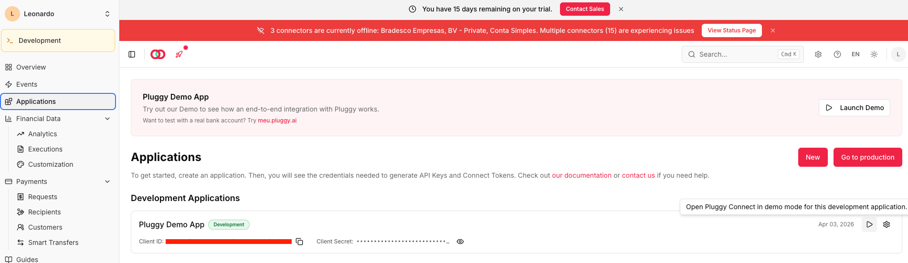
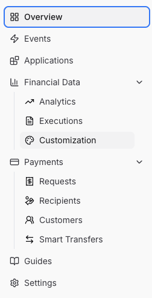
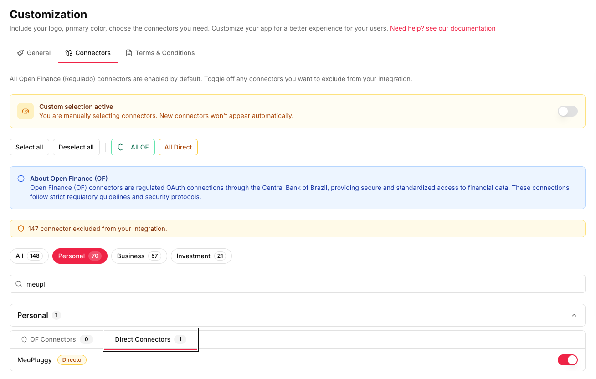
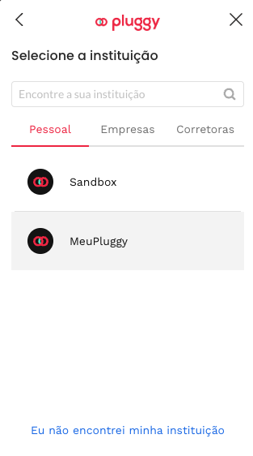

# personal-finance

> Let your agents do the work. Connect your bank accounts, run `/compile`, and get a flat monthly budget ready to visualize.

A Claude Code plugin that fetches bank transactions via **Open Finance (Pluggy)**, classifies expenses, recognizes income, and generates flat monthly budget files — all through natural language skills.

Looking for the web dashboard? See [personal-finance-viewer](https://github.com/icesnow10/personal-finance-viewer).


---

## How it works

```
  You say /compile
        |
        v
    /fetch ---------> pulls transactions from Pluggy API
        |
        v
    /recognize -----> identifies salary & income
        |
        v
    /categorize ----> classifies every expense
        |
        v
    /forecast ------> provisions partial months
        |
        v
   budget_apr_2026.json  (flat array of classified transactions)
        |
        v
   personal-finance-viewer  (grouping, charts, totals)
```

---

## Quick start

### 1. Install the plugin

```bash
/plugin marketplace add icesnow10/personal-finance
/plugin install open-personal-finance@personal-finance
```

### 2. Set up Pluggy

Create a free account at [pluggy.ai](https://pluggy.ai) and launch the demo app.



Navigate to **Customization** in the sidebar to enable the MeuPluggy connector.

<p align="center">
  
</p>



Open Pluggy Connect via the demo app button and select **MeuPluggy** to link your bank.

<p align="center">
  
</p>

Once connected, copy the **Item ID** from the three-dot menu — you'll need it for credentials.


### 3. Onboard

```
/onboard
```

The wizard creates your household folder, saves credentials, and runs the first compilation.

---

## Skills

| Skill | Description |
|---|---|
| **`/onboard`** | Interactive setup wizard for new users. Creates the household folder structure, `.env.local` for credentials, and memory files for expense/income patterns. Optionally runs `/accounts` to auto-detect your connected banks if Pluggy credentials are already set. |
| **`/compile`** | The main command that orchestrates the full pipeline end-to-end. Runs `/fetch` -> `/recognize` -> `/categorize` -> `/forecast` -> `/advise` -> `/notify` in sequence. Produces the final `budget_{month}_{year}.json` flat file ready for the viewer. |
| **`/fetch`** | Authenticates with Pluggy and pulls all BANK + CREDIT transactions for the target month. Writes three raw files: `cc_open_bill.json`, `cc_closed_bill.json`, and `savings.json`. Auto-detects account holders and metadata via the `/accounts` sub-skill. |
| **`/recognize`** | Identifies salary deposits and income sources from savings account movements. Skips internal transfers between own accounts so they don't inflate totals. Uses rules from `income_memory.md` and calls `/learn` to persist any new patterns discovered. |
| **`/categorize`** | Classifies every expense row with `bucket`, `category`, and `subcategory` using merchant patterns from `expenses_memory.md`. Handles refunds, special transactions, and flags anything it can't match as `unclassified`. Calls `/learn` to save newly discovered merchant mappings. |
| **`/forecast`** | Provisions a partial month's budget so numbers are meaningful before the month ends. Combines salary provisioning (expected income not yet deposited) with recurring expense estimates (fixed costs not yet charged). Only runs when the target month is still open. |
| **`/heartbeat`** | Fetches only new transactions from Pluggy and appends them to existing data. Re-runs the full classification pipeline without overwriting prior edits or user corrections. Designed to run on a schedule (cron) or on-demand for mid-month updates. |
| **`/settle`** | Closes the previous month by removing all provisional/estimated rows and locking the final numbers. Then triggers `/heartbeat` for the current month to keep it fresh. Best run at the start of each new month to finalize last month's budget. |
| **`/audit`** | Validates the schema of both raw files and compiled budget output. Auto-fixes common issues like encoding, missing fields, and malformed entries, retrying up to 3 times. Called automatically by `/fetch` and `/heartbeat` to ensure data integrity. |
| **`/learn`** | Detects new transaction patterns that aren't yet saved in memory files. Persists merchant-to-category mappings and income recognition rules so future months classify automatically. Called by `/categorize`, `/recognize`, and `/classify` after each run. |
| **`/advise`** | Analyzes the compiled budget and generates actionable insights. Compares actual spending vs targets, flags problem categories, highlights wins, and provides recommendations. Called automatically at the end of `/compile`. |
| **`/notify`** | Sends budget insights and alerts to your Telegram chat. Reads `TELEGRAM_BOT_TOKEN` and `TELEGRAM_CHAT_ID` from `.env.local`. Skips silently if Telegram is not configured — fully optional. |

---

## Data layout

```
resources/
  household-1/
    .env.local              # Pluggy + Telegram credentials
    expenses_memory.md      # merchant -> category mappings
    income_memory.md        # salary rules and income sources
    pluggy_items.json       # auto-detected accounts metadata
    2026-04/
      expenses/
        cc_open_bill.json       # CC pending transactions
        cc_closed_bill.json     # CC posted transactions
        savings.json            # checking/savings account
        result/
          budget_apr_2026.json  # the final flat output
          insights_*.json       # generated advice
```

---

## Data contract

**Input** — three raw files per month:
- `cc_open_bill.json` — credit card open bill (pending)
- `cc_closed_bill.json` — credit card closed bill (posted)
- `savings.json` — savings/checking account transactions

**Output** — one flat file:
- `budget_{month}_{year}.json` — top-level JSON array of classified transaction rows

Rules:
- No nested category trees in the result
- No summaries or rollups — the viewer handles that
- One flat array, one source of truth

---

## Credentials

Each household has its own `resources/{household}/.env.local`:

```env
PLUGGY_CLIENT_ID=your_client_id
PLUGGY_CLIENT_SECRET=your_client_secret
PLUGGY_ITEM_IDS=item_id_1,item_id_2

# Optional — enables /notify
TELEGRAM_BOT_TOKEN=your_bot_token
TELEGRAM_CHAT_ID=your_chat_id
```

---

## License

MIT
